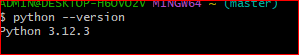
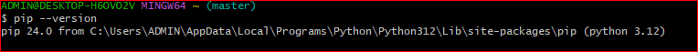

# Dev_Setup
Setup Development Environment

#Assignment: Setting Up Your Developer Environment

#Objective:
This assignment aims to familiarize you with the tools and configurations necessary to set up an efficient developer environment for software engineering projects. Completing this assignment will give you the skills required to set up a robust and productive workspace conducive to coding, debugging, version control, and collaboration.

#Tasks:

1. Select Your Operating System (OS):
   Choose an operating system that best suits your preferences and project requirements. Download and Install Windows 11. https://www.microsoft.com/software-download/windows11

2. Install a Text Editor or Integrated Development Environment (IDE):
   Select and install a text editor or IDE suitable for your programming languages and workflow. Download and Install Visual Studio Code. https://code.visualstudio.com/Download
3. Set Up Version Control System:
   Install Git and configure it on your local machine. Create a GitHub account for hosting your repositories. Initialize a Git repository for your project and make your first commit. https://github.com

4. Install Necessary Programming Languages and Runtimes:
  Instal Python from http://wwww.python.org programming language required for your project and install their respective compilers, interpreters, or runtimes. Ensure you have the necessary tools to build and execute your code.

5. Install Package Managers:
   If applicable, install package managers like pip (Python).

6. Configure a Database (MySQL):
   Download and install MySQL database. https://dev.mysql.com/downloads/windows/installer/5.7.html

7. Set Up Development Environments and Virtualization (Optional):
   Consider using virtualization tools like Docker or virtual machines to isolate project dependencies and ensure consistent environments across different machines.

8. Explore Extensions and Plugins:
   Explore available extensions, plugins, and add-ons for your chosen text editor or IDE to enhance functionality, such as syntax highlighting, linting, code formatting, and version control integration.

9. Document Your Setup:
    Create a comprehensive document outlining the steps you've taken to set up your developer environment. Include any configurations, customizations, or troubleshooting steps encountered during the process. 

#Deliverables:
- Document detailing the setup process with step-by-step instructions and screenshots where necessary.
  Steps on installing windows 11
 1.Check System Requirements
Processor: 1 gigahertz (GHz) or faster with at least 2 cores on a compatible 64-bit processor or system on a chip (SoC)
RAM: 5GB or more
Storage: 64 GB or larger storage device
Internet connection: Internet connectivity is necessary to perform updates and to download and take advantage of some feature.
 2.Backup Your Data
 3.Create Installation Media
-Download the Windows 11 Installation Media Creation Tool
-Go to the Microsoft Windows 11 download page and download the installation media creation tool.
-Create a Bootable USB Drive:
Run the downloaded tool.
Choose the option to create installation media (USB flash drive, DVD, or ISO file) for another PC.
Select your language, edition, and architecture (64-bit).
Choose USB flash drive and follow the prompts to create the installation media.
4.Boot from the Installation Media
-Insert the bootable USB drive into your PC.
-Restart your PC and enter the BIOS/UEFI settings 
-Set the USB drive as the primary boot device. Save changes and exit the BIOS/UEFI settings.
 5.Start the Installation:
-Your PC should boot from the USB drive, and the Windows 11 installation process will start. If prompted, press any key to boot from the USB drive.
-Select your language, time, and keyboard preferences, then click "Next."
Click "Install now."
-Enter your Windows 11 product key or click "I don’t have a product key" if you're doing a clean install 
-Choose "Custom: Install Windows only (advanced)" if you want to perform a clean installation.
-Select the drive where you want to install Windows 11. 
-Follow the prompts to complete the installation. Your PC will restart several times during the process.
 6.Set Up Windows 11
-After installation, you’ll go through the initial setup process where you’ll configure settings such as region, keyboard layout, and network.
-Sign in with your Microsoft account or create a local account.
-Follow the on-screen instructions to complete the setup, including privacy settings, and preferences.
 7.Install Updates and Drivers
-Once Windows 11 is installed, go to Settings > Update & Security > Windows Update and check for updates. Install all available updates.
-Ensure all necessary drivers are installed. You can usually find these on your PC manufacturer’s website.
 8.Restore Your Data.

     Steps to Install Visual Studio Code on Windows
 1.Visit the Visual Studio Code download page and click on the download link for Windows to download the VSCodeUserSetup.exe file.
 2.Run the Installer:
-Locate and double-click the downloaded VSCodeUserSetup.exe file.
-Click Next on the welcome screen.
-Accept the license agreement and click Next.
-Choose the installation location and click Next.
-Select additional tasks and click Next.
-Click Install to begin the installation.
 3.Complete Installation by clicking Finish.
 4.Set Up Visual Studio Code:
-Install Extensions: Open the Extensions view and install necessary extensions.
-Configure Settings: Open settings (Ctrl+,) to customize your environment.

   Setting up version contril system
 1.Install Git 
-Configure Git with your name and email:

2.Create a GitHub Account at GitHub.
-Create a New Repository on GitHub.
-Initialize a Git Repository locally:
-Connect and Push to GitHub:

     Installing Python
 1.Visit python.org.
Download the latest Python installer for Windows.
 2.Run the Installer:
-Check "Add Python to PATH".
-Click "Customize installation", leave defaults, and click "Next".
-Check "Install for all users" and click "Install".
 3.Verify installation
Open Command Prompt and run python --version to check the installation.

  pip Installation
 1.Verify pip:
Run pip --version to ensure pip is installed.

2.Install Necessary Python Packages
Install Packages:
Use pip to install any required packages, e.g., pip install requests.

 Set Up Python in Visual Studio Code
 1.Install Python Extension:
-Open VS Code.
-Go to Extensions (Ctrl+Shift+X), search for "Python", and install the extension by Microsoft.
 2.Configure Python Interpreter.
-Open Command Palette (Ctrl+Shift+P), type Python: Select Interpreter, and choose your installed Python interpreter.

- A GitHub repository containing a sample project initialized with Git and any necessary configuration files (e.g., .gitignore).
https://github.com/Marlyn113/plpproject.git

- A reflection on the challenges faced during setup and strategies employed to overcome them.
-At first, I had installed git 32 bit and when I was submitting the first assignment for week one the git was refusin to push the assignment to GitHub, so I had to delete it and install the one with 64 bit and it has been functioning well.

#Submission:
Submit your document and GitHub repository link through the designated platform or email to the instructor by the specified deadline.

#Evaluation Criteria:**
- Completeness and accuracy of setup documentation.
- Effectiveness of version control implementation.
- Appropriateness of tools selected for the project requirements.
- Clarity of reflection on challenges and solutions encountered.
- Adherence to submission guidelines and deadlines.

Note: Feel free to reach out for clarification or assistance with any aspect of the assignment.

